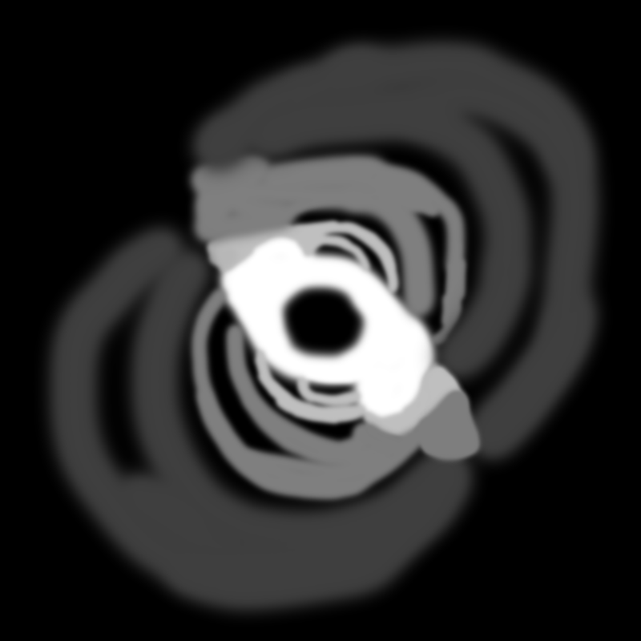

# GalaxyGen

A Locally-Hosted tool to create and edit Stellaris-style Galaxy maps.

[Installation Guide](INSTALLATION.md)

## How to use
1. Create a Density Map named "Distribution.png"
2. Run `placeSystems.py`
3. Render it with `render.py`, or view it with `editor_site.py`
4. If in site, you can touch up the generation to your liking
### Density Map


The Density Map determines the shape of your galaxy, as well as how likely stars are to spawn in specific regions. The Density Map should be grayscale, with dark values indicating low density and bright values indicating high density. 
This is the only actual *map* that you will have to create in order to use GalaxyGen; almost everything else is handled for you. As such, GalaxyGen's generations are almost entirely dependent on the design of the density map. 
To help get good generations, here are some general guidelines for making a Density Map, in no particular order:
 
 - **Give Low-Density Areas space**
Low-Density areas nessasarily need a lot of space to place systems- if you make a low-density area too small, there's a chance that no stars will be placed there at all. Don't be afraid to brush in large strokes.
 - **Apply a Blur Effect after making the map**
Once you've completed the map, you may end up with very sharp edges between areas of different densities. Applying a blur will blend these together so that the difference isn't *stark*, and gives a bit more of a natural feel. 
 - **Use Pitch-Black as a Barrier**
Any color with a [HSV Value](https://color.lukas-stratmann.com/color-systems/hsv.html) of 5 or less (12 or less on a 0-255 scale) will also act as a *barrier* to hyperlanes. You can use this to your advantage in order to split off parts of a galaxy. For example, in the image above it's used to keep branches of the galaxy from connecting to each other, and to represent an impassable black hole at the center.
If you apply a blur, I would reccomend touching up these areas to make sure they haven't been brightened due to the blur.
 - **Keep the Input Image Small**
To ensure all of the galaxy's detail is represented properly, the output image ends up being significantly larger than the input. By default, this scale factor is *16*. That means an 800x800 image results in a *12800x12800* output image (which is enough to represent ~2500 stars). I'd say that 1250x1250 is a reasonable upper limit, though feel free to experiment. The site it built to handle large images, so don't be scared of the huge resolution size.
### Galaxy Generation
If you haven't already, [Download and Build](INSTALLATION.md) GalaxyGen. 
Once you've created your density map, save it as `Distribution.png` and place it in the root directory (meaning the same folder as `placeSystems.py`). 
From there, run the following command in the terminal opened during set-up:
```python placeSystems.py```

This will generate a file called `galaxy.json`. This file defines the galaxy that was just generated, and every detail about it.

`galaxy.json` can be rendered into a actual image using the `render.py` script:

```python render.py```
### Editor
To Edit the Galaxy, or just view it without using an image editor, run the following command:

```python editor_site.py```

Then navigate to `localhost:8080` in any browser to open the site.
To view, click "View Galaxy." To edit, click "Edit Galaxy Geography."

#### Edit Mode UI

**View Mode:** Tells you what an object is when you click on it.
**Delete Star:** Click on any star to select it, and click the "Apply Changes" Button to delete it (along with any hyperlanes connecting to it)
**Add Star:** Click on any empty position on the map, and click "Apply Changes" to create a star there. The new star will not come with automatically-generated hyperlanes.
**Delete Hyperlane:** Click on any hyperlane to select it, and click "Apply Changes" to delete the hyperlane. 
**Add Hyperlane:** Click on any two stars to select them, and click "Apply Changes" to add a hyperlane between them. 

In all modes except *Add Hyperlane*, clicking on an object other than what is currently selected will clear and change the selection to that object. However, in *Add Hyperlane* mode, there are two selections to make. As such, the UI is slightly different for that mode:

A "X" button is added next to each selection, which allows you to clear it. 

## How it works
### Galaxy Generation
**Star Placement**
The brightness of each pixel in the Density map is used as a probability of a star being placed there. The brightness is squared so that there is a more natural progression of density from black to white.
A white pixel is guaranteed to spawn a star, and a black pixel is guaranteed _not_ to spawn a star. Each star's position is saved, and a specific amount (as determined by the `system_count` parameter) of them are randomly picked for use, while the rest are discarded.
**Hyperlane Placement**
We start by doing a [Delaunay Triangulation](https://en.wikipedia.org/wiki/Delaunay_triangulation) on the set of stars to determine all the possible non-intersecting connections between each star.
From there, every star is assigned a certain amount of hyperlanes between 1 - 5, determined by taking the average of density and a random variable. This allows randomness in how many lanes a specific star has, while still having it be influenced by local density. That amount of connections are randomly selected from the total possible connections a given system can make.
### The Output Mask
You may notice that a second image, `output_mask.png` is generated when the galaxy is rendered. This is what allows the editor interface to determine what object is located at any given pixel. To do this, each pixel is used to encode the type and ID of the object located at a given pixel.
The Red Channel has three possible values to denote the type:
 - **0:** Background
 - **127:** Hyperlane
 - **255:** Star

The Blue and Green channels encode the ID, and are determined as such:
 - **Blue Channel:** `id // 255`
 - **Green Channel:** `id % 255`
 More intuitively, you can consider the Blue and Green channels to be the quotient and remainder of dividing the ID of the object by 255. 
 
 This approach limits us to creating 65280 instances of any given object (Hyperlanes or Stars). The Hyperlanes become the more important bottleneck, and limit us to roughly 7000-9000 stars, which is more than enough for most generations.
 
 This can pretty easily be expanded by utilizing more of the Red channel (i.e. Giving Hyperlanes a _range_ of Red Channel values rather than just one), should the need arise.
### Country/Resource Rendering
TBD
## Roadmap

**Features:**
 - [x] Place Stars & Hyperlanes based on Density Map
 - [x] Galaxy Renderer
 - [x] Geography Editor GUI
 - [x] Country Renderer
 - [x] Country Editor GUI
 - [x] Resource Generation
 - [ ] Render Style Presets (Dark, Light, Stellaris, etc)
 - [ ] Config File

**Architecture:**
 - [ ] Compile to Executable Binaries

## Disclaimer for people better than me at programming
This is nowhere near optimized code, and there's almost certainly room for improvement. 

The reason this is set up as a locally-hosted site is so that I can easily run `render.py` and update the map using Flask, while being able to easily create a frontend using Html/JS. This almost certainly isn't the best approach but it's the one I was most familiar with. 

Since this is on GitHub, if you have a problem with how something works feel free to fix it via a Pull Request, Fork, etc etc.
